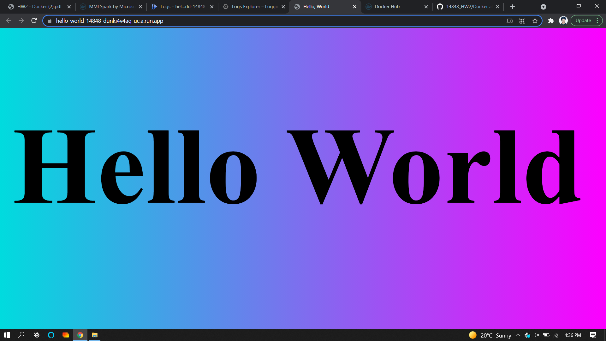
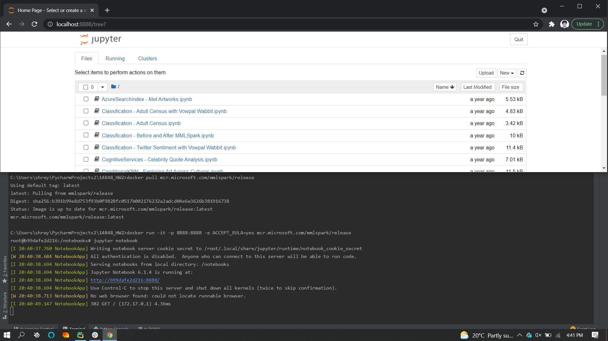
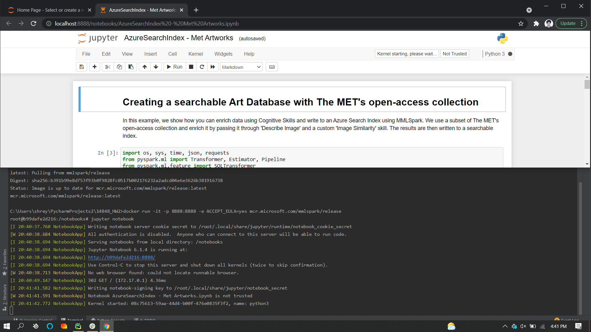
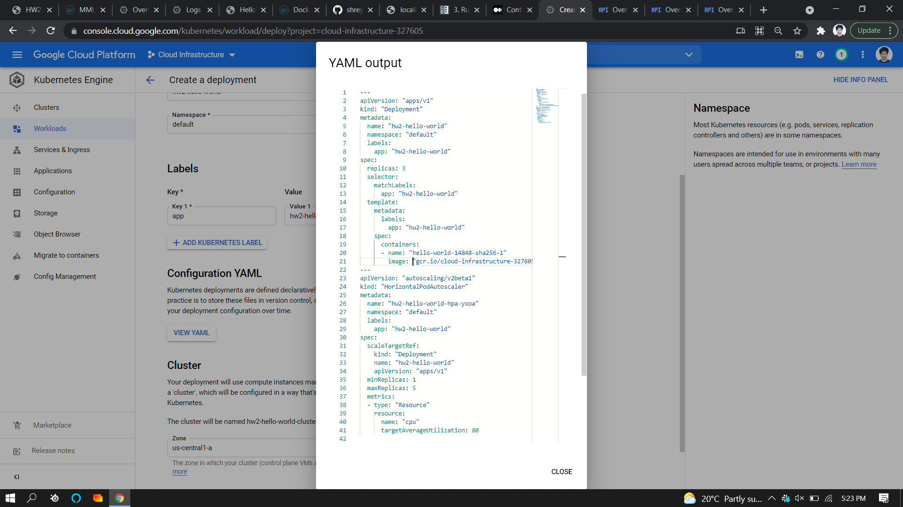
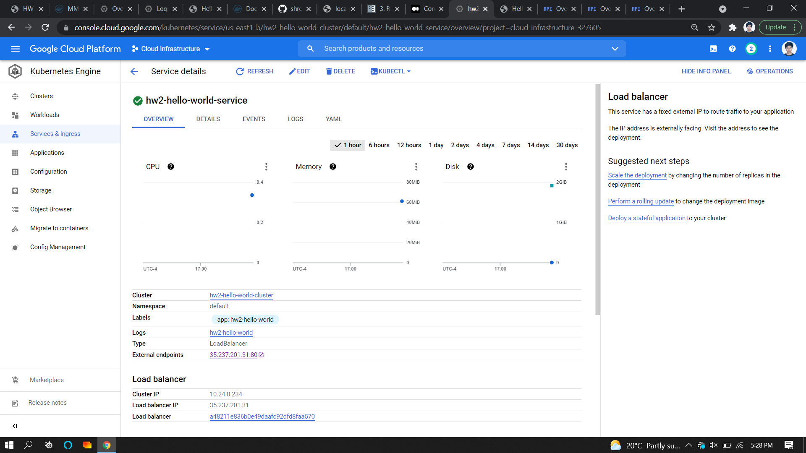
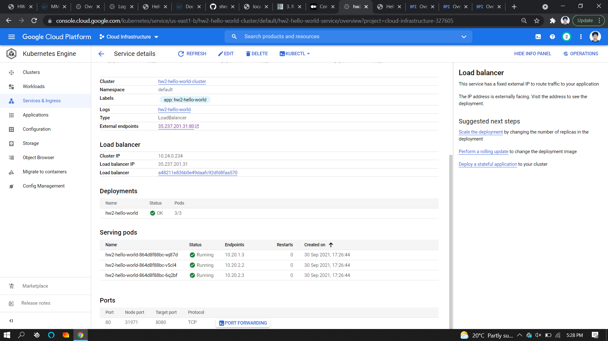

# 14848_HW2 (with extra credit)

## First Container

Docker Hub Link: [https://hub.docker.com/repository/docker/shreyasnagare/hello-world-14848](https://hub.docker.com/repository/docker/shreyasnagare/hello-world-14848)

### Screenshots:

### Code

- [Dockerfile](Docker/Dockerfile)
- [Source code](Docker/app/main.py)

## Second Container

### Screenshots

## Kubernetes Engine

### Screenshots

